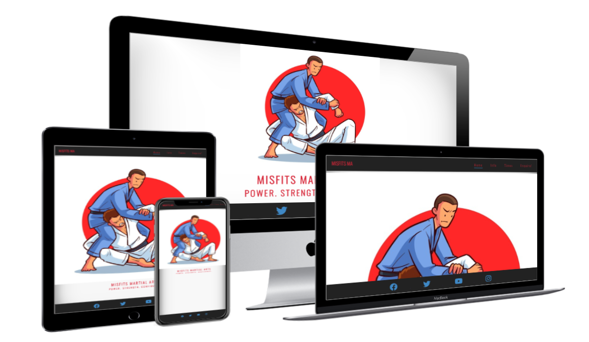
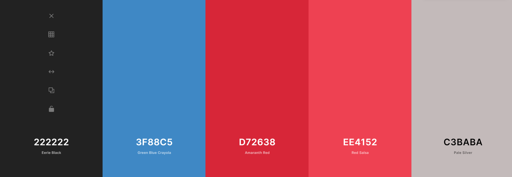

# **My First Project**

## **Project Title**
### *Misfits Martial Arts*
***
## Live Site

[Misfits Martial Arts](https://dsp1994.github.io/My-First-Full-Project/)

## Repository

[https://github.com/DSP1994/My-First-Full-Project](https://github.com/DSP1994/My-First-Full-Project)

## Table of content

- [Purpose](#Purpose)
- [Brief](#Brief)
- [Including](#What-I-entend-to-include)
- [Responsive-Website](#Responsive-Website)
- [Beginning-The-Project](#Beginning-The-Project)
  - [Initial-Idea](#Initial-Idea)
  - [Color-Scheme](#Color-Scheme)
  - [Typography](#Typography)
  - [Images](#Images)
- [During-The-Project](#During-The-Project)
  - [Features-On-The-Site](#Features-On-The-Site)
  - [Technology-Used](#Technology-Used)
- [Completion-Of-The-Website](#Completion-Of-The-Website)
  - [What-Else](#What-Else?)
  - [Personal-Difficulties](#Personal-Difficulties)
  - [Testing](#Testing)
  - [Bugs](#Bugs)
  - [Resolved](#Resolved)
  - [Deployment](#Deployment)
- [Credits](#Credits)
***
## **Purpose**

This website has been built and designed for the sole purpose of my first project through the code institute course. I have been tasked with making a front end website using basic code that I have learnt over the last month, including HTML and CSS. A completed list of technologies can be found in the '[Technology Used](#Technology-Used)' section of this Readme.md

For this website I have decided to design a website based off a hobby close to my heart, Taekwon-Do, after having practiced this sport for almost 20 years, I felt that as a beginning project, it would serve me well if I knew what I was talking about, instead of trying to design a website for something entirely new.
***
## Brief

Misfits Martial Arts, Misfits MA. The end goal of this project is to create a website in which a new potential customer can navigate easily, and quickly access the information that they require to become a new member of the club.
***
### **What I entend to include;**

- A simple homepage from which the potential customer can easily navigate to other pages on the site, or be directed towards their social media links.
- An introduction to the club, for example an *'about us'* section, a quick video to engage with, and possibly upcoming events to engage the customer with.
- Where and when to attend a class, as turning up to the class is usually the hardest part!
- A form for the customer to contact the club with any further questions, along with a page that thanks them for their enquiry.
***
### Responsive Website

***
## **Beginning The Project**
### **Initial Idea**

*Drawings etc*

### **Colour Scheme**
A unique and eye popping color pallet created using *[coolors.co](https://coolors.co)*. Black, red and blue are the senior most colors in Taekwon-Do, so I thought it fitting that these should be represented in the website.

I found that these colors matched surprisingly well with the logo I had decided to use on the homepage. This was, in all honesty, a happy coincidence that I had not planned for, however it made me realise the importance of ensuring no two colors clashed, and made me very aware of what colors I was using on each webpage going through the project.

### **Typography**
The headers on all pages throughout the Website are using the **"Oswald"** font, whilst the main text is using the **"Roboto"** font. Both of which are from google fonts, which can be found in the '[Technology Used](#Technology-Used)' section.

### Images

*site names and places etc*
***
## **During The Project**
### **Features on the site**
By planning out my ideas previously in the '[What-I-Intend-To-Include](#What-I-Intend-To-Include)' section, I was able to essentially 'tick-off' my plans whilst working my way through the project. This allowed me to more effecient throughout.
* The first bullet point was talking about designing an appealing homepage for a potential customer, and having a header and footer that linked to multiple pages and social media links.

> From the beginning, upon opening up the Website, a first time customer is greeted with a friendly cartoon image, a captivating couple of phrases that are straight to the point, and there's no doubting the name of the Website. All this combined ensures the first time user that they are indeed in the correct area.

> With the customer now reassured as to where they are, the header and footer of the Website are clearly visible and are a constant anchor, remaining the same, throughout all the Web pages. This allows the customer to navigate the site quickly and effeciently.

* In order to put the customer at ease that they would be attending the correct club for them, an *'about us'* section was essential.

> When the customer uses the navigation links to click on *'info'* they are greated with an about section which goes into a breif description of the club, how long it has been established, and how they are family oriented. As a first time customer, and potential new student, it is imperative that everyone feels comfortable approaching the club.

> For those who prefer to 'see it, not say it', there is a video clip also linked to this page, which the customer has full control of playing, pausing and adjusting the volume. **Please note; this video is purely fictious and is only a 14 second clip from a website linked in the [Credits](#Credits) section of this Readme file. It is purely for the sake of the project and does not contain any actual information on this fictious club.**

>Finally, for those who are new customers, or returning customers, there is a section dedicated to upcoming events. These events are a great way to open people up to new experiences, and potentially recruit new members to the club who may not have had the opportunity before. A great example of this, is the 'mothers day' event. Many children attend martial art clubs all over the country, and for legal and safety reasons, many parents stay and watch. With mothers day only a few months away, it could allow parents of members of the club a chance to partake in activities that they may not have thought of doing before.

* The times section of the website is an essential part of the website, as it allows for recurring traffic back to the Website.

>Whether a customer on the page is new, or a returning member, having a page that is dedicated to the times and locations of all classes, is a great way to boost traffic to the page. 

>A new customer may simply use it to look for the closest location to their home to debate starting up classes. Which allows them a certain freedom, knowing there is multiple locations, from which they can cater to their own needs.

>Whereas an existing member of the club may fancy a change of venue, and the quickest and easiest way to do this, is to visit the Website and use the *'times'* page.

* Though it is hoped that the previous pages would be sufficient information for new customers to decided whether or not the club is for them, a form page is also very essential for any further questions.

>The form section allows direct communication with the customer, which, for a small local martial arts club, is key to ensuring a long term client. The owner is able to put any worries at rest, and is able to partly meet the customer through email exchanges before they turn up to their first class. Which helps releive a lot of the pressure of turning up for the first time.

>It also allows for existing students to contact their tutor officially through the form, for any concerns, questions on upcoming events, or even to acquire extra help. It is a great way to keep traffic coming back to the site.

The above shows a little insight to what went through my mind in the reasonings behind the pages I decided to use for this project, and how to balance a new customer coming to the site, versus a recurring customer. As both are needed in order to run a successful site.

### **Technologies Used**
*bullet point style list and info*
* *balsamiq*
* compressor.io?
* font awesome  **yes**
* coolors.co
* Chrome Dev Tools (to modifty sizings etc)
* Google fonts
* W3C Mark up Validations Service
***
## **Completion Of The Website**
### **What else would I like to add?**
*any future ideas?*
### **Personal Difficulties**
Struggles, setting the nav links in a straight line.
- background images, enquiry, struggled with center center, put it to top center - 
### **Testing**
*contrast accessibility validator - with results in screen shot form*

*show W3C markup index page and CSS reports via screenshots*

*chromes lighthouse audit service*
### **Bugs**
*any bugs found*
### **Resolved**
*how did i fix these, and what lines?*
### **Deployment**
*how did i deploy it*

## **Credits**
* Content
  * (<a href='https://www.freepik.com/photos/man'>Man photo created by master1305 - www.freepik.com</a>)
* Media
* acknowledgements

### **Personal development**

To begin with I have drawn out, on paper, a 4 page site that I would like to bring to life on the net. A home page, Information page, times & locations page and an enquiry page. I will be using 

## **Credits**
* Me; David